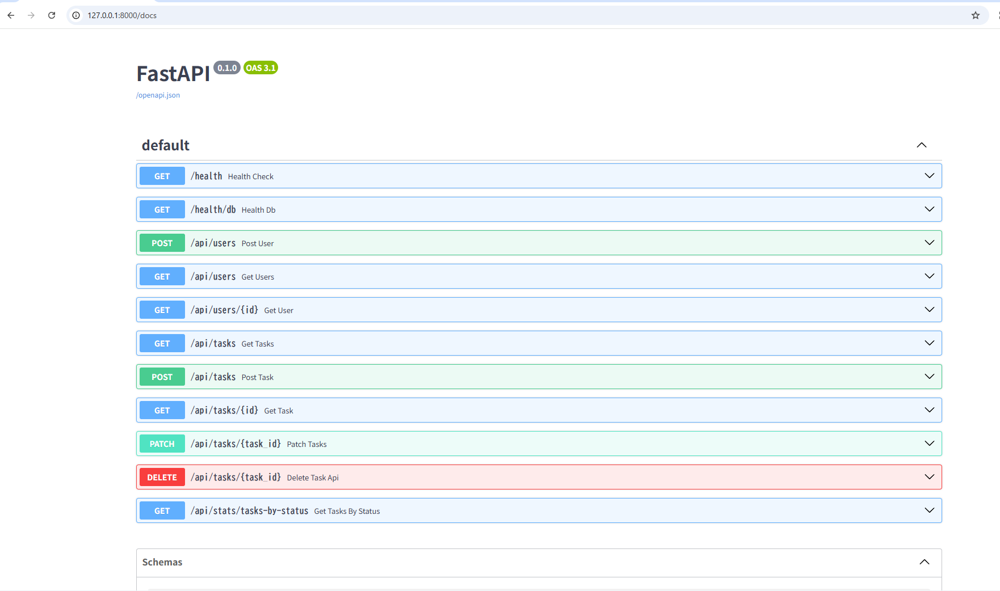

# FastAPI Task Management API (Phase1 / API Only)

FastAPI + PostgreSQL（async SQLAlchemy）で、**タスク管理のCRUD / 一覧（検索・フィルタ・ソート・ページング）/ 集計**までを実装した API オンリーのMVPです。  
Swagger UI（`/docs`）から動作確認できます。




---

## できること（主な機能）

### Users
- ユーザー作成 / 一覧 / 詳細

### Tasks
- タスク作成 / 詳細 / 更新（PATCH）/ 削除（DELETE）
- 一覧取得（検索・フィルタ・ソート・ページング）
  - `q`（title 部分一致）
  - `status`（完全一致）
  - `user_id`（完全一致）
  - `due_from` / `due_to`（期限の範囲）
  - `sort`（許可リストでカラム選択）
  - `order`（asc/desc）
  - `limit` / `offset`

### Stats
- status別件数集計（`todo / doing / done`）

---

## 技術スタック

- Python / FastAPI
- PostgreSQL
- SQLAlchemy（Async）+ asyncpg
- Pydantic（Settings含む）

---

## データモデル（簡易）

### users
- `id` (BIGSERIAL, PK)
- `name` (VARCHAR(80), NOT NULL)
- `email` (VARCHAR(255), NOT NULL, UNIQUE)
- `created_at` (TIMESTAMPTZ, DEFAULT NOW)

### tasks
- `id` (BIGSERIAL, PK)
- `user_id` (BIGINT, NOT NULL, FK -> users.id)
- `title` (VARCHAR(120), NOT NULL)
- `description` (TEXT, NULL)
- `status` (VARCHAR(10), NOT NULL, DEFAULT 'todo') ※ `todo/doing/done` のみ
- `priority` (SMALLINT, NOT NULL, DEFAULT 3) ※ 1〜5
- `due_date` (DATE, NULL)
- `created_at` / `updated_at` (TIMESTAMPTZ, DEFAULT NOW)

DDL: `db/schema.sql`  
Seed: `db/seed.sql`

---

## セットアップ

### 1) 依存関係のインストール

例（requirementsのイメージ）:

- fastapi
- uvicorn[standard]
- sqlalchemy
- asyncpg
- pydantic-settings
- pydantic
- python-dotenv


### 2) PostgreSQL を用意して接続情報を `.env` に設定

このプロジェクトは `pydantic-settings` で環境変数を読み込みます（`backend/settings.py`）。

`.env` 例:

```env
POSTGRE_HOST=localhost
POSTGRE_PORT=5432
POSTGRE_DB=app_db
POSTGRE_USER=app_user
POSTGRE_PW=app_password
APP_ENV=dev
```

`APP_ENV=dev` は用意していますが、現時点では APP_ENV による挙動の切り替えは実装していません。


### 3) DB初期化（schema / seed）

DBを作成し、DDLとseedを投入します（例：psql）。

```bash
# 例: DBに接続（環境に合わせて変更）
psql -h localhost -U app_user -d app_db

# schema.sql を実行
\i db/schema.sql

# seed.sql を実行
\i db/seed.sql
```

> seedは `ON CONFLICT DO NOTHING` のため、基本的に再投入しても壊れない想定です。

### 4) API 起動

プロジェクト構成に合わせて import パスが通る位置で起動してください。  
例：`backend/app/` がパッケージになっている場合

```bash
uvicorn backend.app.main:app --reload --host 127.0.0.1 --port 8000
```

起動後:
- Swagger UI: `http://localhost:8000/docs`
- ヘルスチェック: `http://localhost:8000/health`
- DB疎通: `http://localhost:8000/health/db`

---

## API 仕様（概要）

### Health
- `GET /health`
- `GET /health/db`

### Users
- `POST /api/users`
- `GET /api/users?limit=50&offset=0`
- `GET /api/users/{id}`

### Tasks
- `POST /api/tasks`
- `GET /api/tasks/{id}`
- `PATCH /api/tasks/{task_id}`
- `DELETE /api/tasks/{task_id}`
- `GET /api/tasks`（一覧）

#### タスク一覧の例

- title 部分一致 + status絞り込み + ページング:

```http
GET /api/tasks?q=readme&status=todo&limit=10&offset=0
```

- user_id 絞り込み + 期限範囲:

```http
GET /api/tasks?user_id=3&due_from=2026-02-01&due_to=2026-02-28
```

- ソート（例：priority 昇順）:

```http
GET /api/tasks?sort=priority&order=asc
```

### Stats
- `GET /api/stats/tasks-by-status`

レスポンス例:

```json
{ "todo": 10, "doing": 3, "done": 2 }
```

---

## エラーハンドリング（方針）

- **NotFound（404）**: 存在しないIDなど
- **Conflict（409）**: UNIQUE違反（例：email重複）
- **Validation（400/422）**: 入力不正
- **DB制約違反**: PostgreSQL の SQLSTATE を参照し、代表的な違反をハンドリング
  - 23505: unique_violation → 409
  - 23503: foreign_key_violation → 400
  - 23514: check_violation → 400（status/priority の範囲など）
  - 23502: not_null_violation → 400

---

## メモ

- 本MVPでは `updated_at` は DBトリガーではなく、アプリ側の更新処理で変更する想定です。
- CORSはAPI Onlyのため未設定（Phase2以降でフロント連携する場合に追加）。

---

## ライセンス


