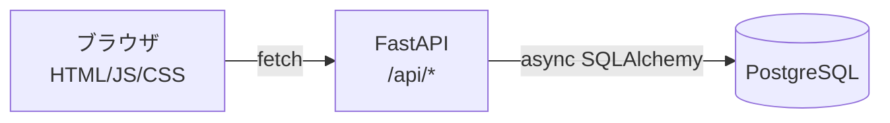
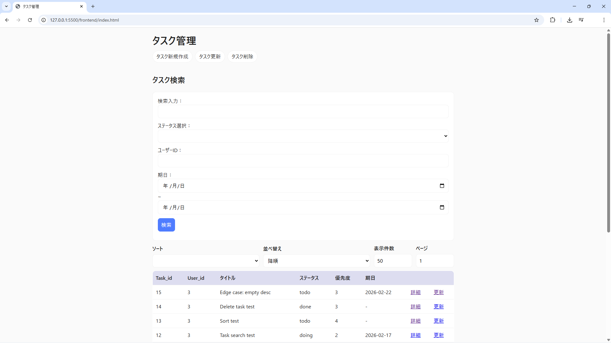

# タスク管理MVP（FastAPI + PostgreSQL）

>**※注釈**
> このREADMEはタスク管理アプリのバックエンド(FastAPI+PostgrSQL)のMVP実装時のものです。
> リポジトリにはフロントエンド(HTML+JavaScript+CSS)の実装まで行ったタスク管理アプリMVPとなっています。
>（READMEは更新予定。）

> **要約**  
> このリポジトリは、**「RDBMS（PostgreSQL）を使ってタスク管理アプリを作る」**ための学習用MVPです。  
> バックエンドは **FastAPI + async SQLAlchemy** で、**タスクのCRUD / 一覧（検索・フィルタ・ソート・ページング）/ status別集計**まで実装しています。  
> フロントエンドは **HTML / JavaScript / CSS** の静的ページで、APIを叩いて動作確認できる最小構成です。


```mermaid
flowchart LR
  Browser[ブラウザ\nHTML/JS/CSS] -->|fetch| API[FastAPI\n/api/*]
  API -->|async SQLAlchemy| DB[(PostgreSQL)]
```



---

## 概要と学習目標

### 概要
- **対象**：タスク管理（Users / Tasks）
- **目的**：フロント → API → DB のデータの流れを理解しながら、MVPとして最低限「動く」状態を作る
- **特徴**：
  - DBスキーマは `db/schema.sql` を実行して作成（マイグレーションは未導入）
  - APIはSwagger UI（`/docs`）で確認可能
  - フロントは静的ファイルをブラウザで開いて利用（推奨：Live Server）

### 学習目標
- FastAPIでのAPI設計（GET/POST/PATCH/DELETE）
- SQLAlchemy（Async）でのDB操作（select / update / delete / count）
- Pydanticでの入力バリデーションとレスポンススキーマ
- 一覧APIにおける **検索・フィルタ・ソート・ページング** の基本形
- 例外（入力エラー・DB制約違反など）をHTTPエラーとして返す考え方

---

## 主な機能と画面

### 主な機能（MVP）
- **Users**
  - ユーザー作成
  - ユーザー一覧
  - ユーザー詳細
- **Tasks**
  - タスク作成
  - タスク詳細
  - タスク更新（PATCH：更新したい項目だけ送る）
  - タスク削除（DELETE）
  - タスク一覧（検索・フィルタ・ソート・ページング相当）
    - `q`：title部分一致
    - `status`：todo / doing / done
    - `user_id`：担当ユーザー
    - `due_from` / `due_to`：期限の範囲
    - `sort`：許可されたカラムのみ
    - `order`：asc / desc
    - `limit` / `offset`
- **Stats**
  - status別件数集計（todo / doing / done）

### フロント画面
- `frontend/index.html`：一覧＋検索/フィルタ/ソート/ページ
- `frontend/task_new.html`：新規作成
- `frontend/task_detail.html`：詳細
- `frontend/task_update.html`：更新
- `frontend/task_delete.html`：削除

---

## 技術構成とディレクトリ

### 使用技術（スタック）
- フロントエンド：HTML / JavaScript / CSS（静的）
- バックエンド：Python / FastAPI
- DB：PostgreSQL
- ORM：SQLAlchemy（Async）+ asyncpg
- バリデーション：Pydantic / pydantic-settings（`.env` 読み込み）

**Pythonのバージョン**：
開発環境は3.13.12。
目安としては、Pydantic v2系を想定して **Python 3.10+** を推奨します。

### ディレクトリ構成（主要ファイル）


| パス | 役割 |
|---|---|
| `backend/app/main.py` | FastAPIアプリ本体、ルーティング、例外ハンドラ、CORS設定 |
| `backend/app/settings.py` | `.env` を読み込み、DB接続URLを組み立て |
| `backend/app/db.py` | SQLAlchemy Async engine / session、`get_db()` 依存関数 |
| `backend/app/errors.py` | アプリ独自例外（NotFound/Conflict/Validationなど） |
| `backend/app/crud/user.py` | UsersのCRUD（現状：作成・一覧・詳細） |
| `backend/app/crud/task.py` | TasksのCRUD＋一覧検索＋集計 |
| `backend/app/models/*` | SQLAlchemyモデル（User / Task、Base） |
| `backend/app/schema_pydantic/*` | Pydanticスキーマ（リクエスト/レスポンス） |
| `db/schema.sql` | DBスキーマ（users/tasks、制約、index） |
| `db/seed.sql` | 初期データ投入（users/tasks） |
| `frontend/js/infra/api.js` | fetch共通処理、API関数（Users/Tasks/Stats） |
| `frontend/js/pages/*.js` | 各画面のUI処理 |
| `requirements.txt` | Python依存ライブラリ |

---

## セットアップと起動

### セットアップ手順

#### 前提（必要なもの）
- Python（3.10+）
- PostgreSQL（ローカル or Dockerなど、方法は自由）
- `psql` コマンド（schema/seed投入に使用）
- フロントを開くためのローカルHTTPサーバ（推奨：VS Code Live Server）

#### 手順チェックリスト
- [ ] リポジトリをclone
- [ ] Python仮想環境を作成・有効化
- [ ] `pip install -r requirements.txt`
- [ ] PostgreSQLを起動
- [ ] DBとユーザーを作成
- [ ] `db/schema.sql` を実行（テーブル作成）
- [ ] `db/seed.sql` を実行（初期データ投入）
- [ ] `.env` を用意
- [ ] バックエンド起動（port 8000）
- [ ] フロント起動（port 5500推奨）→ 画面で動作確認

#### Python依存のインストール
```bash
python -m venv .venv
# Windows: .venv\Scripts\activate
# macOS/Linux: source .venv/bin/activate

pip install -r requirements.txt
```

#### 環境変数（`.env`）
`backend/app/settings.py` が `.env` を読み込みます。

`.env` 例（開発用）：
```env
POSTGRE_HOST=localhost
POSTGRE_PORT=5432
POSTGRE_DB=app_db
POSTGRE_USER=app_user
POSTGRE_PW=app_password
APP_ENV=dev
```

> `APP_ENV` は用意していますが、現時点では環境ごとの挙動切り替えはしていません。

#### DB初期化（schema / seed）
1) DBとユーザー作成（例：ローカル環境の一例。環境に合わせて調整してください）
```bash
# 例：ユーザー作成
createuser -P app_user

# 例：DB作成
createdb -O app_user app_db
```

2) schema / seed を投入
```bash
psql -h localhost -U app_user -d app_db

-- schema.sql を実行
\i db/schema.sql

-- seed.sql を実行
\i db/seed.sql
```

> seedは `ON CONFLICT (id) DO NOTHING` のため、再投入しやすい形にしています。

---

### 起動方法

#### バックエンド（FastAPI）
```bash
uvicorn backend.app.main:app --reload --host 127.0.0.1 --port 8000
```

起動後のURL：
- Swagger UI：`http://localhost:8000/docs`
- ヘルスチェック：`http://localhost:8000/health`
- DB疎通：`http://localhost:8000/health/db`

#### フロントエンド
- 推奨：VS Code拡張「Live Server」などで `frontend/index.html` を開く
- **推奨ポート：5500**（バックエンド側のCORS許可に合わせています）

例：
- `http://localhost:5500/frontend/index.html`

##### CORSについて
バックエンド側で許可しているOriginは、以下の2つです（`backend/app/main.py`）：
- `http://127.0.0.1:5500`
- `http://localhost:5500`

そのため、フロントを別ポートで開く場合はどちらかが必要です：
- Live Serverのポートを **5500** に合わせる  
- OR バックエンドのCORS設定（allow_origins）を変更する

##### APIの接続先（BaseURL）
フロントは `frontend/js/infra/api.js` の `BaseURL` を見に行きます：
- 既定：`http://localhost:8000`

バックエンドを別ホスト/ポートで起動する場合は、ここも合わせて変更してください。

---

## APIとDB設計

### API一覧（概要）
> 詳細はSwagger UI（`/docs`）で確認できます。

| Method | Path | 概要 | 主な入力 | 主な出力 |
|---|---|---|---|---|
| GET | `/health` | 起動確認 | なし | `{ "status": "running" }` |
| GET | `/health/db` | DB疎通確認 | なし | `{ "ok": true, "value": 1 }` |
| POST | `/api/users` | ユーザー作成 | `name`, `email` | `UserRead` |
| GET | `/api/users` | ユーザー一覧 | `limit`, `offset` | `UserRead[]` |
| GET | `/api/users/{id}` | ユーザー詳細 | path: `id` | `UserRead` |
| GET | `/api/tasks` | タスク一覧（検索等） | query各種 | `TaskListResponse` |
| GET | `/api/tasks/{id}` | タスク詳細 | path: `id` | `TaskRead` |
| POST | `/api/tasks` | タスク作成 | `TaskCreate` | `TaskRead` |
| PATCH | `/api/tasks/{task_id}` | タスク更新（部分更新） | `TaskPatch` | `TaskRead` |
| DELETE | `/api/tasks/{task_id}` | タスク削除 | なし | 204 No Content |
| GET | `/api/stats/tasks-by-status` | status別件数 | なし | `{todo, doing, done}` |

#### よく使うタスク一覧の例
```http
GET /api/tasks?q=readme&status=todo&limit=10&offset=0
```

```http
GET /api/tasks?user_id=3&due_from=2026-02-01&due_to=2026-02-28
```

```http
GET /api/tasks?sort=priority&order=asc
```

---

### DB設計
DDLは `db/schema.sql` を参照してください。

```mermaid
erDiagram
  USERS ||--o{ TASKS : has
  USERS {
    BIGSERIAL id PK
    VARCHAR name
    VARCHAR email UNIQUE
    TIMESTAMPTZ created_at
  }
  TASKS {
    BIGSERIAL id PK
    BIGINT user_id FK
    VARCHAR title
    TEXT description Nullable
    VARCHAR status "todo/doing/done"
    SMALLINT priority "1..5"
    DATE due_date Nullable
    TIMESTAMPTZ created_at
    TIMESTAMPTZ updated_at
  }
```

#### 主な制約（MVPとして重要）
- `tasks.user_id` は `users.id` への外部キー
- `tasks.status` は `todo/doing/done` のみ許可（CHECK制約）
- `tasks.priority` は 1〜5 のみ許可（CHECK制約）
- `users.email` は UNIQUE

#### インデックス（学習ポイント）
`tasks` に対して、検索で使いやすいカラムへindexが設定されています：
- `id`, `status`, `due_date`, `updated_at`

---

## 工夫した点と今後の改善

### 工夫した点（学んだこと）
- **Pydanticでのバリデーション**  
  - `EmailStr` を使ってemail形式をチェック  
  - title/name の「空白だけ」を弾くバリデーション（stripして空判定）
- **一覧APIで「必要な機能をまとめて提供」**  
  - `q`（部分一致）/ status / user_id / 期限範囲 / sort / order / limit / offset を1つのAPIで扱う  
  - `total` を返してフロント側でページングしやすい形にする
- **ソートカラムのallowlist（許可リスト）**  
  - 何でもソートできるようにせず、`sort_map` で許可するカラムを限定  
- **DB制約違反の扱い**  
  - PostgreSQLのSQLSTATE（例：23505など）を見て、409/400に変換して返す
- **フロントのAPI呼び出しを共通化**  
  - `request()` にまとめ、HTTPエラー時にJSON/テキストを読み分けて `detail` を出す

### 今後の改善点


| 優先度 | 改善内容 | 理由 |
|---|---|---|
| 高 | 新規作成UIの入力チェック改善（user未選択/priority未入力など） | 初見ユーザーが422/400で詰まりやすい |
| 高 | `task_delete.js` の `disabled` タイポ修正（`disable` → `disabled`） | 二重送信・体験の不安定化を防ぐ |
| 中 | `TaskPatch` のバリデーション強化（priority範囲、title長など） | DB制約で落ちる前に422で返せると分かりやすい |
| 中 | READMEにフロント起動方法（推奨ポート/CORS）の明記 | 動かすときに迷いが減る |
| 低 | ルーティング分割（routers）、サービス層整理 | 学習が進んだ後に読みやすくする |
| 低 | マイグレーション（Alembic）導入 | DB変更の履歴管理（業務寄り） |
| 低 | テスト（pytest）追加 | 品質保証（業務寄り） |

---

## ライセンス

```
